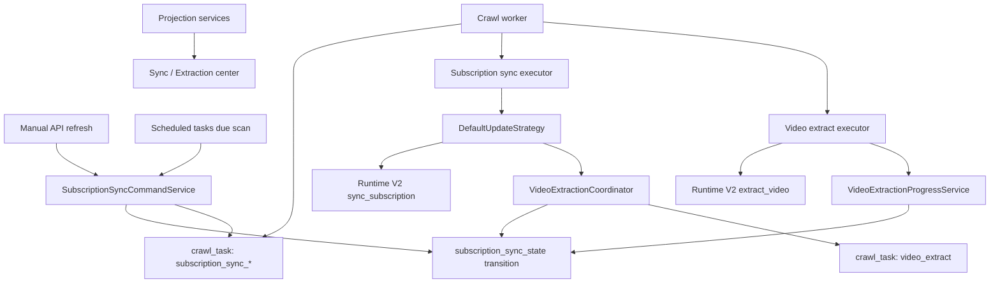

# Design: backend-sync-orchestration-refactor

## Foundation Decisions

This refactor should correct the foundation instead of moving code around the existing shape.

1. `crawl_task` is the only backend async execution queue for subscription sync and video extraction.
2. `scheduled_task` is only a clock/config mechanism. It decides when work is due, then creates `crawl_task` records through the sync command service.
3. `outbox_event` is not part of the subscription sync execution path. Remove `incremental_sync_due` / `full_sync_due` outbox dispatch from this workflow instead of wrapping it.
4. `subscription_sync_state` is the subscription sync state machine. It owns queued/running/success/failed/deferred state, cursor, queue token, and pending video count.
5. `crawl_task` owns execution state only: pending/leased/running/retry/dead/succeeded/cancelled, lease, worker id, attempts, and job status.
6. Sync center and extraction center are read models. They are updated from explicit projection services, not hidden inside generic task persistence.
7. Runtime V2 remains the site boundary. This refactor does not change plugin contracts.

## Target Flow

## Requirement Mapping

| Acceptance Criteria | Implementation |
| --- | --- |
| 1. Queued sync has one explicit public orchestration path | Create `SubscriptionSyncCommandService`. `request_sync()` validates site/subscriber state, prepares/queues sync state, creates the `subscription_sync_*` crawl task directly, appends run events, and returns the existing schedule result shape. Remove `_schedule_one_direct()` and stop using outbox events for sync due execution. |
| 2. Manual inline sync remains available and shares state/event semantics | `run_inline_sync()` uses the same state preparation, queue token, run context, and queued event builder as `request_sync()`, then executes the subscription sync executor inline with `inline_video_extraction=True`. |
| 3. Video extraction task creation has a clear owner | Replace `download_service` for extraction queueing with `VideoExtractionTaskService` in `services/video_extraction/task_service.py`. It creates `video_extract` crawl tasks and owns the dedupe key format. |
| 4. `pending_video_count` has one coordination point | Create `VideoExtractionCoordinator`. It handles discovered-video filtering, blocked/existing skip, pending reservation, async task creation, inline extraction, rollback on enqueue failure, and enqueue events. `DefaultUpdateStrategy` delegates to it. |
| 5. Crawl task lifecycle stays focused | Remove subscription sync retry reconciliation and extraction projection refresh from `CrawlTaskService`. `CrawlTaskService` only mutates task/job rows. Worker runtime calls domain completion hooks after task execution result: subscription retry/failure hooks for subscription tasks, extraction progress/projection hooks for video tasks. |
| 6. Projections remain accurate | Introduce explicit `CrawlTaskProjectionUpdater` calls at command/task execution boundaries. Keep existing projection SQL/snapshot logic, but invoke it from command/progress services instead of generic task persistence. Keep scheduled reconcile as recovery, not the normal path. |
| 7. Runtime invocation preserved | Keep `DefaultUpdateStrategy.fetch_videos()`, `VideoExtractionService` pipeline, and `SiteRuntimeGateway` payload contracts unchanged except import paths around enqueue/progress services. |
| 8. Frontend/desktop contracts pass | Keep route response fields for `/refresh` and `/refresh/direct`. `requestId` for queued refresh becomes the created crawl task id, which is already the meaningful execution id. |
| 9. Tests cover refactored behavior | Replace outbox-centered sync tests with command-service and crawl-task tests. Keep projection, worker, route, strategy, and runtime gateway tests as regression coverage. |

## Files

- `squirrel-backend/services/subscription_update/commands.py` (new): the public command service for queued and inline subscription sync.
- `squirrel-backend/services/subscription_update/run_events.py` (new): small local functions for building run-created, queued, deferred events so queued and inline paths share event semantics.
- `squirrel-backend/services/subscription_update/scheduler.py` (modify): keep due scanning and batch methods; delegate due/manual scheduling to `SubscriptionSyncCommandService`; remove `_schedule_one_direct()` and outbox publication for sync due events.
- `squirrel-backend/services/outbox_event_service.py` (modify): remove subscription sync due handling. Keep only if remaining non-sync use is real; otherwise delete related scheduled consumer task and tests in this feature.
- `squirrel-backend/schedule/tasks/subscription_sync_event_consumer_task.py` (modify/delete): remove from system task bootstrap if outbox no longer has sync work.
- `squirrel-backend/services/subscription_update/strategies/base.py` (modify): full-sync continuation calls `SubscriptionSyncCommandService.request_sync()` directly.
- `squirrel-backend/services/subscription_update/strategies/default_strategy.py` (modify): keep runtime fetch and backfill decision; delegate video extraction enqueue to `VideoExtractionCoordinator`.
- `squirrel-backend/services/subscription_update/video_extraction_coordinator.py` (new): owns video discovery delta handling and pending count reservation.
- `squirrel-backend/services/video_extraction/task_service.py` (new): creates video extraction crawl tasks and clears dedupe keys.
- `squirrel-backend/services/video_extraction/progress_service.py` (new): handles extraction success/failure finalization, pending decrement, dedupe clearing, and projection update trigger.
- `squirrel-backend/services/download_service.py` (delete or reduce to unrelated non-extraction behavior): no longer owns `video_extract` crawl task creation.
- `squirrel-backend/services/video_extraction/extractor.py` (modify): call `VideoExtractionProgressService` in the task boundary instead of direct `subscription_sync_state_service` / `download_service` calls.
- `squirrel-backend/services/crawl_tasks/service.py` (modify): remove business side effects; keep task/job state transitions only.
- `squirrel-backend/processes/managers/crawl_worker_runtime.py` (modify): after execution failure/success, call domain services for subscription task retry reconciliation and video task progress/projection updates.
- `squirrel-backend/services/video_extraction_projection_service.py` (modify only if needed): keep snapshot computation; expose explicit refresh API used by progress/command services.
- Tests:
  - `tests/services/test_subscription_sync_command_service.py` (new)
  - `tests/services/test_video_extraction_task_service.py` (new)
  - `tests/services/test_video_extraction_coordinator.py` (new)
  - `tests/services/test_video_extraction_progress_service.py` (new)
  - Update `test_subscription_update_scheduler.py`, `test_subscription_update_strategy.py`, `test_crawl_task_service.py`, `test_crawl_worker_runtime.py`, `test_video_extraction_center_service.py`
  - Replace or delete outbox sync tests that only exist for `incremental_sync_due` / `full_sync_due`

## Reuse Check

- Reuse `subscription_sync_state_service` transition functions for state changes; do not duplicate SQL.
- Reuse `crawl_task_service.create_job_with_task()` and dispatcher policy.
- Reuse existing strategy/runtime invocation code.
- Reuse existing projection computation; move invocation ownership only.
- Do not create generic event buses, fallback paths, compatibility wrappers, or helper layers that do not remove a real owner conflict.

## Risks

- Removing outbox from sync scheduling changes the internal queue topology. Route/API behavior should remain the same, but tests must pin the new direct crawl-task creation behavior.
- `requestId` for queued sync should consistently become the crawl task id. If any UI assumes an outbox id, that is a real contract and must be handled explicitly in route/API tests.
- Moving task side effects out of `CrawlTaskService` requires worker runtime tests for success, retry, dead, and lease-expired paths.
- Pending count completion remains the highest-risk state transition. The coordinator/progress service must be covered for async enqueue, inline extraction, enqueue failure rollback, extraction success, extraction failure, and retry exhaustion.

## Implementation Order

1. Build `SubscriptionSyncCommandService` around direct crawl task creation and write tests for queued, deferred, in-progress, queued-existing, and inline behavior.
2. Change manual route and scheduler due scans to use the command service.
3. Remove outbox from subscription sync scheduling path and update/delete outbox sync tests.
4. Create `VideoExtractionTaskService`; migrate `download_service` tests and call sites.
5. Create `VideoExtractionCoordinator`; move video delta enqueue logic out of `DefaultUpdateStrategy`.
6. Create `VideoExtractionProgressService`; move pending decrement and dedupe cleanup out of `VideoExtractionService`.
7. Strip business side effects from `CrawlTaskService`; move execution-boundary side effects into worker runtime/domain services.
8. Run focused tests after each step, then affected route/service tests.

## Verification Plan

- Lint: `cd squirrel-backend; pipenv run ruff check`
- Focused tests:
  - `pipenv run pytest tests/services/test_subscription_sync_command_service.py`
  - `pipenv run pytest tests/services/test_subscription_update_scheduler.py`
  - `pipenv run pytest tests/services/test_video_extraction_task_service.py`
  - `pipenv run pytest tests/services/test_video_extraction_coordinator.py`
  - `pipenv run pytest tests/services/test_video_extraction_progress_service.py`
  - `pipenv run pytest tests/services/test_crawl_task_service.py`
  - `pipenv run pytest tests/processes/test_crawl_worker_runtime.py`
  - `pipenv run pytest tests/services/test_video_extraction_center_service.py`
- Broader regression:
  - `pipenv run pytest tests/services/test_subscription_update_strategy.py tests/services/test_subscription_sync_end_to_end_runs.py tests/routes/test_subscription_sync_center_routes.py tests/routes/test_sync_center_stream_route.py tests/routes/test_video_route.py`
- Manual verification:
  - Trigger queued manual refresh and confirm the route returns the same fields and creates a `subscription_sync_*` crawl task.
  - Trigger direct manual refresh and confirm inline behavior still returns found/extracted counts.
  - Confirm sync center shows queued/running/recent states for both subscription sync and video extraction.
  - Force video extraction failure and confirm pending counts do not stay stale.

## Verification Results

In progress.

- `pipenv run python -m compileall services/subscription_update/video_extraction_coordinator.py services/subscription_update/strategies/default_strategy.py tests/services/test_video_extraction_coordinator.py tests/services/test_subscription_update_strategy.py` passed.
- `pipenv run python -m compileall services/video_extraction/progress_service.py services/video_extraction/extractor.py tests/services/test_video_extraction_progress_service.py` passed.
- `pipenv run pytest tests/services/test_subscription_update_scheduler.py tests/services/test_outbox_event_service.py tests/services/test_subscription_update_strategy.py tests/services/test_video_extraction_task_service.py tests/services/test_video_extraction_coordinator.py tests/services/test_video_extraction_progress_service.py tests/services/test_crawl_executors.py tests/processes/test_crawl_worker_runtime.py tests/services/test_crawl_task_service.py tests/services/test_video_extraction_center_service.py -q` passed: 65 passed.
- `pipenv run ruff check` passed.
- After moving task lifecycle side effects out of `CrawlTaskService`, `pipenv run pytest tests/services/test_subscription_update_scheduler.py tests/services/test_outbox_event_service.py tests/services/test_subscription_update_strategy.py tests/services/test_video_extraction_task_service.py tests/services/test_video_extraction_coordinator.py tests/services/test_video_extraction_progress_service.py tests/services/test_subscription_sync_task_progress_service.py tests/services/test_crawl_executors.py tests/processes/test_crawl_worker_runtime.py tests/services/test_crawl_task_service.py tests/services/test_video_extraction_center_service.py -q` passed: 68 passed.
- `pipenv run ruff check` passed after the task lifecycle side-effect move.
- Broader route/service regression command `pipenv run pytest tests/services/test_subscription_sync_end_to_end_runs.py tests/routes/test_subscription_sync_center_routes.py tests/routes/test_sync_center_stream_route.py tests/routes/test_video_route.py -q` currently fails in existing test scaffolding unrelated to the new command/task boundaries: stale `_refresh_runtime_sync_health` patch target, missing `subscription_sync_event` table in SQLite setup, stale `routes.subscription.sync_center_stream_service` monkeypatch target, and stale `SyncStateService.crawl_task_service` attribute assumption.

Remaining implementation work:

- Revisit stale sync-center regression tests separately before marking this feature done.
